# Episode 4: Testing & Quality Assurance

!!! clipboard-list "Learning Objectives"
    By the end of this episode, you will:
    
    - Write effective tests with pytest
    - Measure code coverage
    - Format code with black and ruff
    - Check types with mypy
    - Set up pre-commit hooks for automation
    - Configure tool settings in pyproject.toml

## 🎬 Ensuring Quality

Sarah's `kir-pydemo` package is growing, and she's worried:

> "I added new features, but did I break anything? How do I know my code works correctly? What if I accidentally introduce bugs?"

A colleague suggests: "You need automated testing and code quality tools!"

**The solution?** A comprehensive testing and quality assurance setup!

## 🧪 Testing with pytest

### Why Write Tests?

- **Catch bugs early** before users find them
- **Prevent regressions** when adding features
- **Document behavior** through examples
- **Enable refactoring** with confidence

### Installing pytest

We already added it to our `[dev]` extras:

```bash
uv pip install -e ".[dev]"
```

### Step 1: Create Test Files

Create `tests/test_sequence.py`:

<div class="dracula" markdown="1">
```python
"""Tests for sequence analysis functions."""

import pytest

from kir_pydemo.sequence import gc_content, reverse_complement


class TestGCContent:
    """Tests for GC content calculation."""
    
    def test_basic_gc_content(self):
        """Test basic GC content calculation."""
        assert gc_content("ATGC") == 50.0
        assert gc_content("AAAA") == 0.0
        assert gc_content("GGGG") == 100.0
        assert gc_content("CCCC") == 100.0
    
    def test_mixed_case(self):
        """Test that mixed case is handled correctly."""
        assert gc_content("AtGc") == 50.0
        assert gc_content("atgc") == 50.0
        assert gc_content("ATGC") == 50.0
    
    def test_empty_sequence_raises_error(self):
        """Test that empty sequence raises ValueError."""
        with pytest.raises(ValueError, match="cannot be empty"):
            gc_content("")
    
    def test_long_sequence(self):
        """Test with a longer sequence."""
        seq = "ATGC" * 1000  # 4000 bp, 50% GC
        assert gc_content(seq) == 50.0
    
    @pytest.mark.parametrize("sequence,expected", [
        ("ATGC", 50.0),
        ("AAAA", 0.0),
        ("GGGG", 100.0),
        ("ATATATATATAT", 0.0),
        ("GCGCGCGCGCGC", 100.0),
        ("AATTCCGG", 50.0),
    ])
    def test_various_sequences(self, sequence, expected):
        """Test GC content with various sequences."""
        assert gc_content(sequence) == expected


class TestReverseComplement:
    """Tests for reverse complement."""
    
    def test_basic_reverse_complement(self):
        """Test basic reverse complement."""
        assert reverse_complement("ATGC") == "GCAT"
        assert reverse_complement("AAAA") == "TTTT"
        assert reverse_complement("GGGG") == "CCCC"
    
    def test_palindrome(self):
        """Test palindromic sequences."""
        # GAATTC is a palindrome
        assert reverse_complement("GAATTC") == "GAATTC"
    
    def test_mixed_case(self):
        """Test mixed case handling."""
        assert reverse_complement("AtGc") == "gCaT"
        assert reverse_complement("atgc") == "gcat"
    
    def test_empty_sequence(self):
        """Test empty sequence returns empty."""
        assert reverse_complement("") == ""
    
    @pytest.mark.parametrize("sequence,expected", [
        ("A", "T"),
        ("T", "A"),
        ("G", "C"),
        ("C", "G"),
        ("AT", "AT"),
        ("ATCG", "CGAT"),
    ])
    def test_individual_bases(self, sequence, expected):
        """Test individual bases and small sequences."""
        assert reverse_complement(sequence) == expected
```
</div>

!!! tip "Test Organization"
    - Group related tests in classes
    - Use descriptive test names: `test_what_condition_expected`
    - Test both normal cases and edge cases
    - Use `@pytest.mark.parametrize` for multiple similar tests

### Step 2: Run Tests

<div class="dracula" markdown="1">
```py
# Run all tests
pytest

# Run with verbose output
pytest -v

# Run specific test file
pytest tests/test_sequence.py

# Run specific test
pytest tests/test_sequence.py::TestGCContent::test_basic_gc_content

# Run tests matching a pattern
pytest -k "gc_content"
```
</div>


### Step 3: Code Coverage

See which parts of your code are tested:

<div class="dracula" markdown="1">
```python
# Run tests with coverage
pytest --cov=kir_pydemo

# Generate HTML coverage report
pytest --cov=kir_pydemo --cov-report=html

# Open in browser
open htmlcov/index.html  # Mac
xdg-open htmlcov/index.html  # Linux
```
</div>

**Output:**
<div class="nord" markdown="1">
```c
Name                         Stmts   Miss  Cover
------------------------------------------------
src/kir_pydemo/__init__.py       3      0   100%
src/kir_pydemo/cli.py           77     77     0%
src/kir_pydemo/io.py            16     16     0%
src/kir_pydemo/sequence.py      10      0   100%
------------------------------------------------
TOTAL                          106     93    12%
```
</div>

!!! bell "Coverage Goals"
    - **80%+** is good for most projects
    - **100%** is ideal but not always practical
    - Focus on testing critical paths, not just hitting 100%

### Step 4: Testing CLI

Create `tests/test_cli.py`:

<div class="dracula" markdown="1">
```python
"""Tests for command-line interface."""

import sys
from pathlib import Path
from unittest.mock import patch

import pytest

from kir_pydemo.cli import main


def test_gc_content_command(capsys):
    """Test gc-content command."""
    testargs = ["kir-pydemo", "gc-content", "ATGC"]
    with patch.object(sys, 'argv', testargs):
        exit_code = main()
    
    captured = capsys.readouterr()
    assert exit_code == 0
    assert "50.00%" in captured.out


def test_reverse_complement_command(capsys):
    """Test reverse-complement command."""
    testargs = ["kir-pydemo", "reverse-complement", "ATGC"]
    with patch.object(sys, 'argv', testargs):
        exit_code = main()
    
    captured = capsys.readouterr()
    assert exit_code == 0
    assert "GCAT" in captured.out


def test_missing_sequence_error(capsys):
    """Test error when no sequence provided."""
    testargs = ["kir-pydemo", "gc-content"]
    with patch.object(sys, 'argv', testargs):
        exit_code = main()
    
    captured = capsys.readouterr()
    assert exit_code == 1
    assert "Error" in captured.err


def test_version_flag(capsys):
    """Test --version flag."""
    testargs = ["kir-pydemo", "--version"]
    with patch.object(sys, 'argv', testargs):
        with pytest.raises(SystemExit) as exc_info:
            main()
    
    assert exc_info.value.code == 0
```
</div>

## 🎨 Code Formatting

### Black - The Uncompromising Code Formatter

[Black](https://black.readthedocs.io/) formats Python code automatically:

<div class="nord" markdown="1">
```py
# Format all files
black src/ tests/

# Check what would change (don't modify)
black --check src/ tests/

# Show diff
black --diff src/ tests/
```
</div>

**Before:**
<div class="dracula" markdown="1">
```python
def gc_content(sequence:str)->float:
    if not sequence:raise ValueError("Sequence cannot be empty")
    sequence=sequence.upper()
    return (sequence.count('G')+sequence.count('C'))/len(sequence)*100
```

**After:**
```python
def gc_content(sequence: str) -> float:
    if not sequence:
        raise ValueError("Sequence cannot be empty")
    sequence = sequence.upper()
    return (sequence.count('G') + sequence.count('C')) / len(sequence) * 100
```
</div>

### Ruff - Fast Python Linter

[Ruff](https://docs.astral.sh/ruff/) is an extremely fast linter that checks for errors and style issues:

<div class="dracula" markdown="1">
```py
# Lint all files
ruff check src/ tests/

# Fix auto-fixable issues
ruff check --fix src/ tests/

# Format code (alternative to black)
ruff format src/ tests/
```
</div>

!!! magnifying-glass "Common issues it catches:"

    - Unused imports
    - Undefined variables
    - F-string errors
    - Import sorting
    - Line length
    - And 800+ more rules!

### Configuration in pyproject.toml

Add tool configurations to `pyproject.toml`:

<div class="monokai" markdown="1">
```toml
[tool.black]
line-length = 100
target-version = ["py39", "py310", "py311", "py312"]
include = '\.pyi?$'

[tool.ruff]
line-length = 100
target-version = "py39"

[tool.ruff.lint]
select = [
    "E",   # pycodestyle errors
    "W",   # pycodestyle warnings
    "F",   # pyflakes
    "I",   # isort (import sorting)
    "B",   # flake8-bugbear
    "C4",  # flake8-comprehensions
    "UP",  # pyupgrade
]
ignore = [
    "E501",  # line too long (handled by formatter)
]

[tool.ruff.lint.per-file-ignores]
"__init__.py" = ["F401"]  # Allow unused imports in __init__.py

[tool.pytest.ini_options]
testpaths = ["tests"]
python_files = ["test_*.py"]
python_classes = ["Test*"]
python_functions = ["test_*"]
addopts = [
    "--strict-markers",
    "--strict-config",
    "-ra",
]

[tool.coverage.run]
source = ["kir_pydemo"]
omit = ["*/tests/*"]

[tool.coverage.report]
exclude_lines = [
    "pragma: no cover",
    "def __repr__",
    "raise AssertionError",
    "raise NotImplementedError",
    "if __name__ == .__main__.:",
    "if TYPE_CHECKING:",
]
```
</div>

## 🔍 Type Checking with mypy

[mypy](http://mypy-lang.org/) checks type hints for errors:

```bash
# Check types
mypy src/

# More strict checking
mypy --strict src/
```

**Example issues mypy catches:**

```python
# ❌ Type error
def gc_content(sequence: str) -> float:
    return sequence.count('G')  # Returns int, not float!

# ✅ Fixed
def gc_content(sequence: str) -> float:
    return float(sequence.count('G'))
```

### Configure mypy

Add to `pyproject.toml`:

<div class="monokai" markdown="1">
```toml
[tool.mypy]
python_version = "3.9"
warn_return_any = true
warn_unused_configs = true
disallow_untyped_defs = true
disallow_incomplete_defs = true
check_untyped_defs = true
no_implicit_optional = true

[[tool.mypy.overrides]]
module = "Bio.*"
ignore_missing_imports = true
```
</div>

## 🪝 Pre-commit Hooks

[Pre-commit](https://pre-commit.com/) runs checks automatically before each commit:

### Step 1: Install pre-commit

```bash
uv pip install pre-commit
```

### Step 2: Create .pre-commit-config.yaml

<div class="nord" markdown="1">
```yaml
# .pre-commit-config.yaml
repos:
  - repo: https://github.com/pre-commit/pre-commit-hooks
    rev: v4.5.0
    hooks:
      - id: trailing-whitespace
      - id: end-of-file-fixer
      - id: check-yaml
      - id: check-added-large-files
      - id: check-toml

  - repo: https://github.com/psf/black
    rev: 23.12.1
    hooks:
      - id: black

  - repo: https://github.com/astral-sh/ruff-pre-commit
    rev: v0.1.13
    hooks:
      - id: ruff
        args: [--fix]
      - id: ruff-format

  - repo: https://github.com/pre-commit/mirrors-mypy
    rev: v1.8.0
    hooks:
      - id: mypy
        
```
</div>

### Step 3: Install the hooks

<div class="dracula" markdown="1">
```py
# Install pre-commit hooks
pre-commit install

# Run on all files (first time)
pre-commit run --all-files
```
</div>

Now checks run automatically on `git commit`:

<div class="github-dark" markdown="1">
```py
git add .
git commit -m "Add new feature"
```
</div>
??? success "Output"

    ```
    [WARNING] Unstaged files detected.
    [INFO] Stashing unstaged files to /home/dinindu/.cache/pre-commit/patch1776361930-81948.
    trim trailing whitespace.................................................Passed
    fix end of files.........................................................Failed
    - hook id: end-of-file-fixer
    - exit code: 1
    - files were modified by this hook

    Fixing src/kir_pydemo.egg-info/dependency_links.txt
    Fixing src/kir_pydemo.egg-info/SOURCES.txt

    check yaml...............................................................Passed
    check for added large files..............................................Passed
    check toml...............................................................Passed
    black....................................................................Failed
    - hook id: black
    - files were modified by this hook

    reformatted src/kir_pydemo/io.py

    All done! ✨ 🍰 ✨
    1 file reformatted, 5 files left unchanged.

    ruff.....................................................................Failed
    - hook id: ruff
    - files were modified by this hook

    Found 7 errors (7 fixed, 0 remaining).

    ruff-format..............................................................Passed
    mypy.....................................................................Passed
    [WARNING] Stashed changes conflicted with hook auto-fixes... Rolling back fixes...
    [INFO] Restored changes from /home/dinindu/.cache/pre-commit/patch1776361930-81948.
    ```

    **What Pre-commit Did**
    Pre-commit automatically fixed issues before allowing your commit:

    - ✅ end-of-file-fixer - Added missing newlines at end of files
    - ✅ black - Reformatted io.py to meet style standards
    - ✅ ruff - Fixed 7 auto-fixable linting issues

    **Why It "Failed"**
    The hooks show as "Failed" because they modified your files. Pre-commit blocks the commit to let you review the automatic changes.
    This is a safety feature - it prevents you from committing code that doesn't meet your quality standards.

    **What To Do Next**
    Now you need to stage the auto-fixed changes and commit again:
    <div class="dracula" markdown="1">
    ```c
    # Stage the automatically fixed files
    git add -u

    # Or stage everything
    git add .

    # Try committing again
    git commit -m "Add new feature"
    ```

    This time, it should pass! ✅

    **Pro Tip**

    You can see what changed:
    <div class="draculae" markdown="1">
    ```c
    # See what the hooks modified
    git diff

    # Or if you already staged them
    git diff --staged
    ```

    #### Pre-commit Workflow

    

!!! tip "Skip Hooks When Needed"
    ```bash
    # Skip all hooks
    git commit --no-verify -m "Quick fix"
    
    # Skip specific hook
    SKIP=mypy git commit -m "WIP: not type-safe yet"
    ```

## 📋 Development Workflow

A typical development session:
<div class="dracula" markdown="1">
```py
# 1. Activate virtual environment
source venv/bin/activate

# 2. Install in editable mode with dev dependencies
pip install -e ".[dev]"

# 3. Install pre-commit hooks
pre-commit install

# 4. Make changes to code
# ... edit src/kir_pydemo/sequence.py

# 5. Run tests
pytest

# 6. Check coverage
pytest --cov=kir_pydemo --cov-report=term-missing

# 7. Format code
black src/ tests/
ruff check --fix src/ tests/

# 8. Type check
mypy src/

# 9. Commit (pre-commit runs automatically)
git add .
git commit -m "Add feature X"
```
</div>

??? file-circle-mark "Above might fail"

    ```bash
    tests/test_sequence.py:10: error: Function is missing a return type annotation  [no-untyped-def]
    tests/test_sequence.py:10: note: Use "-> None" if function does not return a value
    tests/test_sequence.py:17: error: Function is missing a return type annotation  [no-untyped-def]
    tests/test_sequence.py:17: note: Use "-> None" if function does not return a value
    tests/test_sequence.py:23: error: Function is missing a return type annotation  [no-untyped-def]
    tests/test_sequence.py:23: note: Use "-> None" if function does not return a value
    tests/test_sequence.py:28: error: Function is missing a return type annotation  [no-untyped-def]
    tests/test_sequence.py:28: note: Use "-> None" if function does not return a value
    tests/test_sequence.py:44: error: Function is missing a type annotation  [no-untyped-def]
    tests/test_sequence.py:52: error: Function is missing a return type annotation  [no-untyped-def]
    tests/test_sequence.py:52: note: Use "-> None" if function does not return a value
    tests/test_sequence.py:58: error: Function is missing a return type annotation  [no-untyped-def]
    tests/test_sequence.py:58: note: Use "-> None" if function does not return a value
    tests/test_sequence.py:63: error: Function is missing a return type annotation  [no-untyped-def]
    tests/test_sequence.py:63: note: Use "-> None" if function does not return a value
    tests/test_sequence.py:68: error: Function is missing a return type annotation  [no-untyped-def]
    tests/test_sequence.py:68: note: Use "-> None" if function does not return a value
    tests/test_sequence.py:83: error: Function is missing a type annotation  [no-untyped-def]
    tests/test_cli.py:10: error: Function is missing a type annotation  [no-untyped-def]
    tests/test_cli.py:21: error: Function is missing a type annotation  [no-untyped-def]
    tests/test_cli.py:32: error: Function is missing a type annotation  [no-untyped-def]
    tests/test_cli.py:43: error: Function is missing a type annotation  [no-untyped-def]
    Found 14 errors in 2 files (checked 2 source files)
    ```

    1. **Why ?** mypy is now checking your test files and complaining that test functions don't have type annotations.
    2. **The Issue**
        - `mypy` config has disallow_untyped_defs = true, which means every function must have type hints. Test functions like:
            ```py
            def test_basic_gc_content(self):  # ❌ Missing -> None
                assert gc_content("ATGC") == 50.0
            ```
        - Need to be:
            ```py
            def test_basic_gc_content(self) -> None:  # ✅ Has return type
                assert gc_content("ATGC") == 50.0
            ```
    3. **The Fix  ( Easiest) - Relax mypy Rules for Tests**
        -  Add this to your mypy config in `pyproject.toml`
        <div class="dracula" markdown="1">
        ```toml
        # NEW: Relax rules for test files
        [[tool.mypy.overrides]]
        module = "tests.*"
        disallow_untyped_defs = false
        disallow_incomplete_defs = false
        ```
        </div>

    <div class="nord" markdown="1">
    ```py
    git add .
    git commit -m "Add feature X"
    ```
    </div>


### Makefile for Common Tasks

Create a `Makefile`:
<div class="nord" markdown="1">
```yaml
.PHONY: install test coverage format lint type-check clean all

install:
	pip install -e ".[dev]"
	pre-commit install

test:
	pytest

coverage:
	pytest --cov=kir_pydemo --cov-report=html --cov-report=term

format:
	black src/ tests/
	ruff check --fix src/ tests/

lint:
	ruff check src/ tests/

type-check:
	mypy src/

clean:
	rm -rf build dist *.egg-info
	rm -rf htmlcov .coverage
	rm -rf .pytest_cache .mypy_cache .ruff_cache
	find . -type d -name __pycache__ -exec rm -rf {} +

all: format lint type-check test
```
</div>

Usage:

```bash
make install      # Install package and hooks
make test         # Run tests
make coverage     # Test with coverage report
make format       # Format code
make lint         # Check linting
make type-check   # Check types
make all          # Run all checks
make clean        # Clean build artifacts
```

## 📋 Checkpoint: What Have We Achieved?

Verify you've successfully completed Episode 4:

- [ ] Written tests in `tests/test_sequence.py`
- [ ] Run tests with pytest and achieved >80% coverage
- [ ] Configured black, ruff, and mypy in `pyproject.toml`
- [ ] Formatted code with black or ruff format
- [ ] Fixed linting issues with ruff
- [ ] Type-checked code with mypy
- [ ] Set up pre-commit hooks with `.pre-commit-config.yaml`
- [ ] Created a `Makefile` for common development tasks

## 🎯 Key Takeaways

1. **pytest** provides powerful testing with fixtures, parametrize, and coverage
2. **black/ruff** automatically format code to a consistent style
3. **mypy** catches type errors before runtime
4. **pre-commit** automates checks before each commit
5. **pyproject.toml** centralizes tool configuration
6. **Makefile** simplifies common development commands

## 🚀 What's Next?

In Episode 5 (the finale!), we'll learn how to **Build & Distribute** kir-pydemo:

- Building wheel and source distributions
- Version management strategies
- Publishing to PyPI (or private repos)
- Creating documentation with Sphinx
- CI/CD with GitHub Actions

This will make your package ready for the world!

## 📚 Further Reading

- [pytest documentation](https://docs.pytest.org/)
- [Black documentation](https://black.readthedocs.io/)
- [Ruff documentation](https://docs.astral.sh/ruff/)
- [mypy documentation](http://mypy-lang.org/)
- [pre-commit documentation](https://pre-commit.com/)

---

**Previous:** [← Episode 3: Dependencies](episode-03.md) | **Next:** [Episode 5: Building & Distribution →](episode-05.md)
