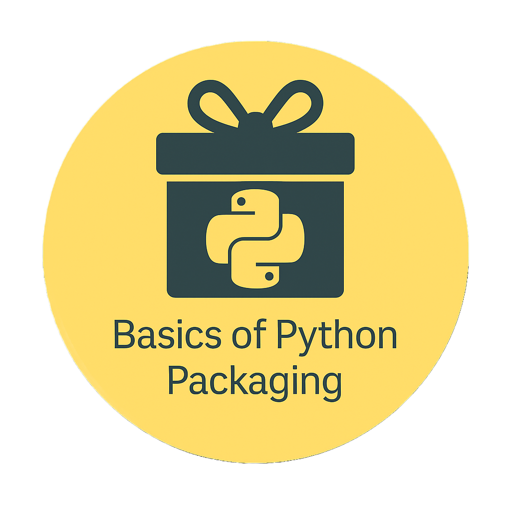

  <a href="https://kir-rescomp.github.io/kir-training-home/">← Return to KIR Training Catalogue</a>

<h1></h1>

  

    🚧
    Work in Progress
  

  
This repository is under active development. Expected completion: <strong>20th of April 2026</strong>

    

## Episodes

-   __[Episode 1: Project Structure & pyproject.toml](episode-01.md)__

    ---
    **Duration:** ~45 minutes
    
    Learn the foundation of modern Python packaging:

    - Understanding pyproject.toml vs setup.py
    - The src/ layout pattern
    - Package metadata and configuration
    - Installing in editable mode

    **You'll create:** A basic installable package

    

-   __[Episode 2: Entry Points & CLI Tools](episode-02.md)__
    
    ---
    **Duration:** ~30 minutes

    Make your package executable from the command line:

    - Console scripts and entry points
    - Command-line argument parsing
    - Building user-friendly CLIs

    **You'll create:** Command-line tools for sequence analysis

   

-   __[Episode 3: Dependencies & Environments](episode-03.md)__

    ---
    **Duration:** ~40 minutes

    Master dependency management:

    - Specifying dependencies in pyproject.toml
    - Optional dependencies and extras
    - Virtual environments best practices
    - Lock files and reproducibility

    **You'll create:** A properly managed dependency structure

    

-   __[Episode 4: Testing & Quality](episode-04.md)__

    ---
    **Duration:** ~50 minutes

    Ensure code quality and reliability:

    - Adding tests with pytest
    - Code formatting with black/ruff
    - Type checking with mypy
    - Pre-commit hooks for automation

    **You'll create:** A tested, quality-controlled package

  

-   __[Episode 5: Building & Distribution](episode-05.md)__

    ---
    **Duration:** ~45 minutes

    Share your package with the world:

    - Building wheels and source distributions
    - Version management strategies
    - Publishing to PyPI
    - Documentation with Sphinx
